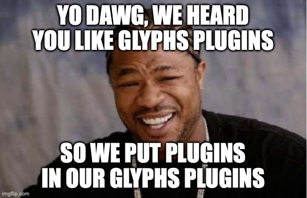

# Corretto Plugin for Glyphs

Extendable post-processing system for Glyphs.app. Apply corrections to font
files on each export.

## For Type Designers

When you have the Corretto plugin installed, it will get called whenever you
export a font. It will then check for any custom parameters using a special
prefix (`de.kutilek.corretto...`), which are used to configure Corretto’s
operation.

Those custom parameters can be added to the font or the instance/exports.
Export level parameters will take precedence over font level parameters.

## For Developers And Font Engineers



The functionality of Corretto is based on plugins. Corretto comes with a
number of built-in plugins. You can configure which of those are called, and
in which order, in a YAML configuration file located at
`~/Library/Application Support/Glyphs 3/global.correttoconfig.yaml`:

```yaml
corretto:
  plugins:
    - module: corretto.plugins.MathTable
    - module: corretto.plugins.MergeTTX
    - module: corretto.plugins.FixedPitch
    - module: corretto.plugins.GaspTable
    - module: corretto.plugins.DeltaBase
    - module: corretto.plugins.MaxpStack
    - module: corretto.plugins.HeadTable
    - module: corretto.plugins.VariableFontMetrics
    - module: corretto.plugins.Save
    - module: corretto.plugins.SaveTTX
    - module: corretto.plugins.Webfonts
```

A problem with plugins that get called on Glyphs’ `DOCUMENTEXPORTED` callback
is that the order in which they are called is non-deterministic. So if you have
multiple plugins, they may interfere with each other’s operation.

Corretto allows developers to add their own plugins to the configuration file,
which will then be executed in the specified order.

The API for Corretto plugins is simple. There's an example plugin right here in
the `demo-plugin` folder.

## Installation

Install Corretto through the [Glyphs Plugin Manager](glyphsapp3://showplugin/Corretto%20Post-Processor).

For more information, make sure to check out the [extensive documentation on the dedicated Corretto website](https://corretto.kutilek.de).
